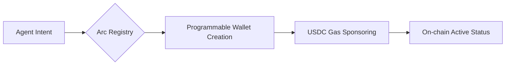

# 🤖 Arc AI Agent Registration Kit
> **A comprehensive developer kit for registering AI Agents on Arc Network. Featuring on-chain identity implementation, programmable wallet integration, and a detailed troubleshooting guide for the Agentic Economy.**

## 🧠 Why Agentic Identity?
Most AI Agents today are "trapped" in sandboxed environments, unable to interact with the real-world economy. By leveraging **Arc Network’s Identity Registry**, we are moving from **Passive Bots** to **Autonomous Financial Entities**.

This project isn't just about running a script; it's about solving the **Identity & Liquidity Paradox**:
1. **Identity:** How does an Agent prove it's a unique entity without a centralized ID?
2. **Liquidity:** How does an Agent pay for its own compute and settle transactions autonomously?

## 📋 Prerequisites
Before you begin, make sure you have:
1. **Circle Developer Console account:** Sign up at [console.circle.com](https://console.circle.com/).
2. **Standard API Key:** Created via `Keys` → `Create a key` → `Standard Key`.
3. **Registered Entity Secret:** Ensure your Entity Secret is registered in the Console `Config` section.
4. **You need `Node.js` version 22 or later** (check using the command `node -v`).

## 🏗️ Architecture Workflow

## 🚀 Getting Started
**1. Installation**

```
mkdir erc8004-quickstart
cd erc8004-quickstart
npm init -y
npm pkg set type=module
npm pkg set scripts.start="tsx --env-file=.env index.ts"
npm install @circle-fin/developer-controlled-wallets viem
npm install --save-dev tsx typescript @types/node
```
**2. Create a `tsconfig.json` file:**

```
npx tsc --init
```


**Delete everything and paste it in**
```
{
  "compilerOptions": {
    "target": "ESNext",
    "module": "ESNext",
    "moduleResolution": "bundler",
    "strict": true,
    "types": ["node"]
  }
}
```
**3. An API key created in the [console.circle.com](https://console.circle.com/): Keys → Create a key → API key → Standard Key**

**4. Register Your Entity Secret**

Install the SDK
```
npm install @circle-fin/developer-controlled-wallets --save
```
**Create a generate-secret.ts file:**
Fill:
```
import { generateEntitySecret } from "@circle-fin/developer-controlled-wallets";

generateEntitySecret();
```
Run:
```
npx tsx generate-secret.ts
```
**Create a register-secret.ts file:**

Fill:
```
import { registerEntitySecretCiphertext } from "@circle-fin/developer-controlled-wallets";

const response = await registerEntitySecretCiphertext({
  apiKey:
    "CHANGE YOUR_API_KEY",
  entitySecret: "CHANGE YOUR ENTITYSECRET",
  recoveryFileDownloadPath: "",
});
console.log(response.data?.recoveryFile);
```

Run:
```
npx tsx register-secret.ts
```

**5. Setting environment variables `.env`**

**Create a `.env` file**

```
touch .env
```

**Copy the Entity Secret (64 hexadecimal characters) and paste it into the `.env` file:**

```
CIRCLE_API_KEY=your_actual_api_key_here
CIRCLE_ENTITY_SECRET=paste_entity_secret_here
```

**6. Create a Developer-Controlled Wallet (Owner & Validator)**

The repository already contains the `index.ts` file - this is the main file for creating two programmable wallets on the Arc Testnet.

Create the `index.ts` file and paste all the code into it.

**Important Note:**

**Ensure your .env has the correct two variables:**

```
CIRCLE_API_KEY=your_actual_api_key
CIRCLE_ENTITY_SECRET=your_64_hex_entity_secret
```

Run
```
npm run start
```


**You will see two wallet addresses printed out on the Arc Testnet.**

**Explanation:**

Owner Wallet: Used to own the AI ​​Agent (cannot vote for its own reputation).
Validator Wallet: Used to record the agent's reputation.

Both are SCA (Smart Contract Account) on ARC-TESTNET.

## 🆘 Facing Issues?
If you encounter errors during setup, please refer to our detailed `TROUBLESHOOTING.md` guide. I have documented every common error from Entity Secret fails to Gas issues.

After successful execution, you will have two wallet addresses. Copy them to use in the next step.

## 👨‍💻 Builder
**X: @khois0512**

**Vision: Building the foundation for AI-to-Human commerce.**

**Still not fixed?** Open an [Issue](https://github.com/Thanhdatne/arc-ai-agent-registration-kit/issues) or ping me on X
