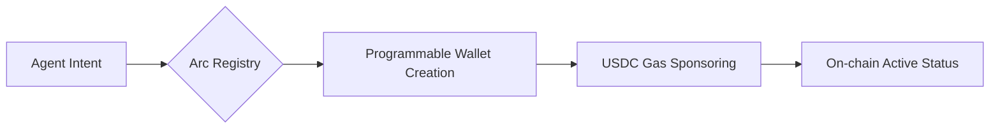

# 🤖 Arc AI Agent Registration guide
> **The ultimate step-by-step guide to registering AI Agents on Arc Network. Features full on-chain identity (ERC-8004) implementation, programmable wallet setup via Circle SDK, and a deep-dive troubleshooting manual**

## 🧠 Why Agentic Identity?
Most AI Agents today are "trapped" in sandboxed environments, unable to interact with the real-world economy. By leveraging **Arc Network’s Identity Registry**, we are moving from **Passive Bots** to **Autonomous Financial Entities**.

This project isn't just about running a script; it's about solving the **Identity & Liquidity Paradox**:
1. **Identity:** How does an Agent prove it's a unique entity without a centralized ID?
2. **Liquidity:** How does an Agent pay for its own compute and settle transactions autonomously?

## 📋 Prerequisites
Before you begin, make sure you have:
1. **Circle Developer Console account:** Sign up at [console.circle.com](https://console.circle.com/).
2. **Standard API Key:** Created via `Keys` → `Create a key` → `Standard Key`.
3. **Registered Entity Secret:** Ensure your Entity Secret is registered in the Console `Config` section.
4. **You need `Node.js` version 22 or later** (check using the command `node -v`).

## 🏗️ Architecture Workflow

## 🚀 Getting Started
**1. Installation**

```
mkdir erc8004-quickstart
cd erc8004-quickstart
npm init -y
npm pkg set type=module
npm pkg set scripts.start="tsx --env-file=.env index.ts"
npm install @circle-fin/developer-controlled-wallets viem
npm install --save-dev tsx typescript @types/node
```
**2. Create a `tsconfig.json` file:**

```
npx tsc --init
```


**Delete everything and paste it in**
```
{
  "compilerOptions": {
    "target": "ESNext",
    "module": "ESNext",
    "moduleResolution": "bundler",
    "strict": true,
    "types": ["node"]
  }
}
```
**3. An API key created in the [console.circle.com](https://console.circle.com/): Keys → Create a key → API key → Standard Key**

**4. Register Your Entity Secret**

Install the SDK
```
npm install @circle-fin/developer-controlled-wallets --save
```
**Create a generate-secret.ts file:**
Fill:
```
import { generateEntitySecret } from "@circle-fin/developer-controlled-wallets";

generateEntitySecret();
```
Run:
```
npx tsx generate-secret.ts
```
**Create a register-secret.ts file:**

Fill:
```
import { registerEntitySecretCiphertext } from "@circle-fin/developer-controlled-wallets";

const response = await registerEntitySecretCiphertext({
  apiKey:
    "CHANGE YOUR_API_KEY",
  entitySecret: "CHANGE YOUR ENTITYSECRET",
  recoveryFileDownloadPath: "",
});
console.log(response.data?.recoveryFile);
```

Run:
```
npx tsx register-secret.ts
```

**5. Setting environment variables `.env`**

**Create a `.env` file**

```
touch .env
```

**Copy the Entity Secret (64 hexadecimal characters) and paste it into the `.env` file:**

```
CIRCLE_API_KEY=your_actual_api_key_here
CIRCLE_ENTITY_SECRET=paste_entity_secret_here
```

**6. Create a Developer-Controlled Wallet (Owner & Validator)**

The repository already contains the `index.ts` file - this is the main file for creating two programmable wallets on the Arc Testnet.

Create the `index.ts` file and paste all the code into it.

<details>
<summary>Click to view full index.ts code</summary>

```typescript
import { initiateDeveloperControlledWalletsClient } from "@circle-fin/developer-controlled-wallets";
import {
  createPublicClient,
  http,
  parseAbiItem,
  getContract,
  keccak256,
  toHex,
} from "viem";
import { arcTestnet } from "viem/chains";

const IDENTITY_REGISTRY = "0x8004A818BFB912233c491871b3d84c89A494BD9e";
const REPUTATION_REGISTRY = "0x8004B663056A597Dffe9eCcC1965A193B7388713";
const VALIDATION_REGISTRY = "0x8004Cb1BF31DAf7788923b405b754f57acEB4272";

const METADATA_URI =
  process.env.METADATA_URI ||
  "ipfs://bafkreibdi6623n3xpf7ymk62ckb4bo75o3qemwkpfvp5i25j66itxvsoei";

const circleClient = initiateDeveloperControlledWalletsClient({
  apiKey: process.env.CIRCLE_API_KEY!,
  entitySecret: process.env.CIRCLE_ENTITY_SECRET!,
});

const publicClient = createPublicClient({
  chain: arcTestnet,
  transport: http(),
});

// Helper functions
async function waitForTransaction(txId: string, label: string) {
  process.stdout.write(`  Waiting for ${label}`);
  for (let i = 0; i < 30; i++) {
    await new Promise((r) => setTimeout(r, 2000));
    const { data } = await circleClient.getTransaction({ id: txId });
    if (data?.transaction?.state === "COMPLETE") {
      const txHash = data.transaction.txHash;
      console.log(` ✓\n  Tx: https://testnet.arcscan.app/tx/${txHash}`);
      return txHash;
    }
    if (data?.transaction?.state === "FAILED") {
      throw new Error(`${label} failed onchain`);
    }
    process.stdout.write(".");
  }
  throw new Error(`${label} timed out`);
}

// Main invocation
async function main() {
  console.log("\n── Step 1: Create wallets ──");

  const walletSet = await circleClient.createWalletSet({
    name: "ERC8004 Agent Wallets",
  });

  const walletsResponse = await circleClient.createWallets({
    blockchains: ["ARC-TESTNET"],
    count: 2,
    walletSetId: walletSet.data?.walletSet?.id ?? "",
    accountType: "SCA",
  });

  const ownerWallet = walletsResponse.data?.wallets?.[0]!;
  const validatorWallet = walletsResponse.data?.wallets?.[1]!;

  console.log(`  Owner:     ${ownerWallet.address} (${ownerWallet.id})`);
  console.log(
    `  Validator: ${validatorWallet.address} (${validatorWallet.id})`,
  );

  console.log("\n── Step 2: Register agent identity ──");
  console.log(`  Metadata URI: ${METADATA_URI}`);

  const registerTx = await circleClient.createContractExecutionTransaction({
    walletAddress: ownerWallet.address!,
    blockchain: "ARC-TESTNET",
    contractAddress: IDENTITY_REGISTRY,
    abiFunctionSignature: "register(string)",
    abiParameters: [METADATA_URI],
    fee: { type: "level", config: { feeLevel: "MEDIUM" } },
  });

  await waitForTransaction(registerTx.data?.id!, "registration");

  console.log("\n── Step 3: Retrieve agent ID ──");

  const latestBlock = await publicClient.getBlockNumber();
  const blockRange = 10000n; // RPC limit: eth_getLogs is often capped at 10,000 blocks
  const fromBlock = latestBlock > blockRange ? latestBlock - blockRange : 0n;

  const transferLogs = await publicClient.getLogs({
    address: IDENTITY_REGISTRY,
    event: parseAbiItem(
      "event Transfer(address indexed from, address indexed to, uint256 indexed tokenId)",
    ),
    args: { to: ownerWallet.address as `0x${string}` },
    fromBlock,
    toBlock: latestBlock,
  });

  if (transferLogs.length === 0) {
    throw new Error("No Transfer events found — registration may have failed");
  }

  const agentId =
    transferLogs[transferLogs.length - 1].args.tokenId!.toString();

  const identityContract = getContract({
    address: IDENTITY_REGISTRY,
    abi: [
      {
        name: "ownerOf",
        type: "function",
        stateMutability: "view",
        inputs: [{ name: "tokenId", type: "uint256" }],
        outputs: [{ name: "", type: "address" }],
      },
      {
        name: "tokenURI",
        type: "function",
        stateMutability: "view",
        inputs: [{ name: "tokenId", type: "uint256" }],
        outputs: [{ name: "", type: "string" }],
      },
    ],
    client: publicClient,
  });

  const owner = await identityContract.read.ownerOf([BigInt(agentId)]);
  const tokenURI = await identityContract.read.tokenURI([BigInt(agentId)]);

  console.log(`  Agent ID:     ${agentId}`);
  console.log(`  Owner:        ${owner}`);
  console.log(`  Metadata URI: ${tokenURI}`);

  console.log("\n── Step 4: Record reputation ──");

  const tag = "successful_trade";
  const feedbackHash = keccak256(toHex(tag));

  const reputationTx = await circleClient.createContractExecutionTransaction({
    walletAddress: validatorWallet.address!,
    blockchain: "ARC-TESTNET",
    contractAddress: REPUTATION_REGISTRY,
    abiFunctionSignature:
      "giveFeedback(uint256,int128,uint8,string,string,string,string,bytes32)",
    abiParameters: [agentId, "95", "0", tag, "", "", "", feedbackHash],
    fee: { type: "level", config: { feeLevel: "MEDIUM" } },
  });

  await waitForTransaction(reputationTx.data?.id!, "reputation");

  console.log("\n── Step 5: Verify reputation ──");

  const reputationLogs = await publicClient.getLogs({
    address: REPUTATION_REGISTRY,
    fromBlock: latestBlock - 1000n,
    toBlock: "latest",
  });

  console.log(`  Found ${reputationLogs.length} feedback event(s)`);

  // Owner requests; validator responds per ERC-8004
  console.log("\n── Step 6: Request validation ──");

  const requestURI = "ipfs://bafkreiexamplevalidationrequest";
  const requestHash = keccak256(
    toHex(`kyc_verification_request_agent_${agentId}`),
  );

  const validationReqTx = await circleClient.createContractExecutionTransaction(
    {
      walletAddress: ownerWallet.address!,
      blockchain: "ARC-TESTNET",
      contractAddress: VALIDATION_REGISTRY,
      abiFunctionSignature: "validationRequest(address,uint256,string,bytes32)",
      abiParameters: [
        validatorWallet.address!,
        agentId,
        requestURI,
        requestHash,
      ],
      fee: { type: "level", config: { feeLevel: "MEDIUM" } },
    },
  );

  await waitForTransaction(validationReqTx.data?.id!, "validation request");

  // Validator responds; 100 = passed, 0 = failed
  console.log("\n── Step 7: Validation response ──");

  const validationResTx = await circleClient.createContractExecutionTransaction(
    {
      walletAddress: validatorWallet.address!,
      blockchain: "ARC-TESTNET",
      contractAddress: VALIDATION_REGISTRY,
      abiFunctionSignature:
        "validationResponse(bytes32,uint8,string,bytes32,string)",
      abiParameters: [
        requestHash,
        "100",
        "",
        "0x" + "0".repeat(64),
        "kyc_verified",
      ],
      fee: { type: "level", config: { feeLevel: "MEDIUM" } },
    },
  );

  await waitForTransaction(validationResTx.data?.id!, "validation response");

  console.log("\n── Step 8: Check validation ──");

  const validationContract = getContract({
    address: VALIDATION_REGISTRY,
    abi: [
      {
        name: "getValidationStatus",
        type: "function",
        stateMutability: "view",
        inputs: [{ name: "requestHash", type: "bytes32" }],
        outputs: [
          { name: "validatorAddress", type: "address" },
          { name: "agentId", type: "uint256" },
          { name: "response", type: "uint8" },
          { name: "responseHash", type: "bytes32" },
          { name: "tag", type: "string" },
          { name: "lastUpdate", type: "uint256" },
        ],
      },
    ],
    client: publicClient,
  });

  type ValidationStatus = readonly [
    `0x${string}`,
    bigint,
    number,
    `0x${string}`,
    string,
    bigint,
  ];

  const [valAddr, , valResponse, , valTag] =
    (await validationContract.read.getValidationStatus([
      requestHash,
    ])) as ValidationStatus;

  console.log(`  Validator:  ${valAddr}`);
  console.log(`  Response:   ${valResponse} (100 = passed)`);
  console.log(`  Tag:        ${valTag}`);

  console.log("\n── Complete ──");
  console.log("  ✓ Identity registered");
  console.log("  ✓ Reputation recorded");
  console.log("  ✓ Validation requested and verified");
  console.log(
    `\n  Explorer: https://testnet.arcscan.app/address/${ownerWallet.address}\n`,
  );
}

main().catch((error) => {
  console.error("\nError:", error.message ?? error);
  process.exit(1);
});
```

</details>

**Important Note:**

```
CIRCLE_API_KEY=your_actual_api_key
CIRCLE_ENTITY_SECRET=your_64_hex_entity_secret
```
**Ensure your .env has the correct two variables:**

Run
```
npm run start
```


**You will see two wallet addresses printed out on the Arc Testnet.**

**Explanation:**

Owner Wallet: Used to own the AI ​​Agent (cannot vote for its own reputation).
Validator Wallet: Used to record the agent's reputation.

Both are SCA (Smart Contract Account) on ARC-TESTNET.

## 🆘 Facing Issues?
If you encounter errors during setup, please refer to our detailed `TROUBLESHOOTING.md` guide. I have documented every common error from Entity Secret fails to Gas issues.

After successful execution, you will have two wallet addresses. Copy them to use in the next step.

## 👨‍💻 Builder
**X: @khois0512**

**Vision: Building the foundation for AI-to-Human commerce.**

**Still not fixed?** Open an [Issue](https://github.com/Thanhdatne/arc-ai-agent-registration-kit/issues) or ping me on X

**Next Step: Once your agent is registered, learn how to execute commercial tasks and handle payments using** **[Phase 2: Job Execution (ERC-8183)](https://github.com/Thanhdatne/arc-agent-smart-account-erc8183)** - Learn how your registered agent can accept jobs, use USDC for gas, and get paid.
